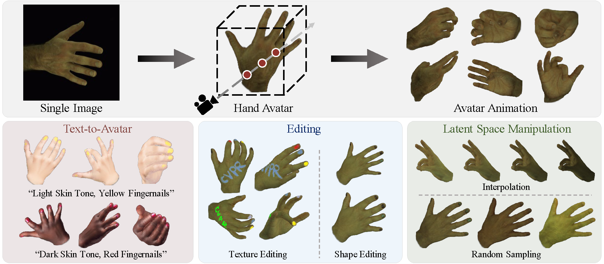

<div align="center">

<h1>OHTA: One-shot Hand Avatar via Data-driven Implicit Priors</h1>

<div>
    <a href='https://scholar.google.com/citations?user=3hSD41oAAAAJ' target='_blank'>Xiaozheng Zheng<sup>*</sup></a>&emsp;
    <a href='https://scholar.google.com/citations?user=v8TFZI4AAAAJ' target='_blank'>Chao Wen<sup>*</sup></a>&emsp;
    <a href='https://suzhuo.github.io/' target='_blank'>Zhuo Su<sup></sup></a>&emsp;
    <a href='https://scholar.google.com/citations?user=Yeawk5sAAAAJ' target='_blank'>Zeran Xu<sup></sup></a>&emsp;
    <a href='https://github.com/lizhaohu' target='_blank'>Zhaohu Li<sup></sup></a>&emsp;
    <a href='https://github.com/uzhaoyang' target='_blank'>Yang Zhao<sup></sup></a>&emsp;
    <a href='https://scholar.google.com/citations?&user=ECKq3aUAAAAJ' target='_blank'>Zhou Xue<sup>†</sup></a>&emsp;


</div>
<div>
    PICO, ByteDance
</div>
<div>
    <sup>*</sup>Equal contribution &emsp; <sup>†</sup>Corresponding author
</div>
<div>
    :star_struck: <strong>Accepted to CVPR 2024</strong>
</div>

---



<strong> OHTA is a novel approach capable of creating implicit animatable hand avatars using just a single image. It facilitates 1) text-to-avatar conversion, 2) hand texture and geometry editing, and 3) interpolation and sampling within the latent space.</strong>

---

<a href='https://zxz267.github.io/OHTA/'></a> <a href='http://arxiv.org/abs/2402.18969'></a> [](https://youtu.be/VPjjHNgtzJI)


</div>

## :mega: Updates

[06/2024] :star_struck: Code released!

[02/2024] :partying_face: OHTA is accepted to CVPR 2024! Working on code release!

## :desktop_computer: Installation
### Environment
Create the conda environment for OHTA with the given script:
```
bash scripts/create_env.sh
```

### SMPL-X
You should accept [SMPL-X Model License](https://smpl-x.is.tue.mpg.de/modellicense.html) and install [SMPL-X](https://github.com/vchoutas/smplx). 

### MANO
You should accept [MANO License](https://mano.is.tue.mpg.de/license.html) and download the [MANO](https://mano.is.tue.mpg.de/) model from the official website.

### PairOF and MANO-HD
Download the pre-trained PairOF and MANO-HD from [here](https://drive.google.com/drive/folders/19X0XOPWCrTPx4IAs2jpj34qbO0bC2Pew), which are provided by [HandAvatar](https://github.com/SeanChenxy/HandAvatar). 
We refer to the MANO-HD implementation from [HandAvatar](https://github.com/SeanChenxy/HandAvatar).

## 🔥 Pre-trained Model 
We provide the pre-trained model after prior learning, which can be used for one-shot creation. Please download the weights from [link](https://drive.google.com/file/d/1QnmU5qJcM-TLoVhpZIUA2ct1aXaQ5hvH/).


## :file_folder: Data Preparation

### Training and evaluation on InterHand2.6M
You should download the dataset from the official website to train the prior model or evaluate the one-shot performance on [InterHand2.6M](https://mks0601.github.io/InterHand2.6M/).
After downloading the pre-trained models and data, you should organize the folder as follows:
```
ROOT
    ├── data
    │   └── InterHand
    │       └── 5
    │           └── annotations
    │           └── InterHand2.6M_5fps_batch1
    ├── output
    │   └── pretrained_prior_learning.tar
    ├── third_parties
    │   ├── mano
    │   │   ├── MANO_RIGHT.pkl -> models/MANO_RIGHT.pkl
    │   │   ├── models
    │   ├── pairof
    │   │   ├── out
    │   ├── smplx
    │   │   ├── out
```

For training and evaluation, you also need to generate hand segmentations.
First, you should follow [HandAvatar](https://github.com/SeanChenxy/HandAvatar) to generate masks by MANO rendering.
Please refer to `scripts/seg_interhand2.6m_from_mano.py` for generating the MANO segmentation:
```
python scripts/seg_interhand2.6m_from_mano.py
```

To better train the prior model, we further utilize [SAM](https://github.com/facebookresearch/segment-anything) to generate more hand-aligned segmentations with joint and bounding box prompts.
We strongly recommend using segmentations as well as possible for prior learning.
Please refer to `scripts/seg_with_sam.py` for more details:
```
python scripts/seg_with_sam.py
```


### Data for One-shot Creation
For one-shot creation, you should use the hand pose estimator to predict the MANO parameters of the input image, and then process the data to the input format.

We have provided a tool for obtaining HandMesh through fitting, along with metadata in the required format. You can refer to [HandMesh](https://github.com/walsvid/HandMesh) for data preparation tools. Our method is not limited to using [HandMesh](https://github.com/walsvid/HandMesh); you can also use other Hand Mesh Estimators such as [Hamer](https://github.com/geopavlakos/hamer). You can also refer to `scripts/seg_with_sam.py` for generating the hand mask of in-the-wild hand images.


We provide the process script in `scripts/process_interhand2.6m`, which can process the data of InterHand2.6M to the format for one-shot creation.
```
python scripts/process_interhand2.6m.py
```

We also provide some processed samples in `example_data`.


## :runner: Avatar Creation
### One-shot creation
After processing the image to the input format, you can use the `create.py` script to create the hand avatar as below:
```
python create.py --cfg configs/interhand/ohta_create.yaml \
--input example_data/in_the_wild/img/02023.jpg \
--checkpoint output/pretrained_prior_learning.tar
```

### Texture editing
You can also edit the avatar with the given content and the corresponding mask:
```
python create.py --cfg configs/interhand/ohta_create.yaml \
--input example_data/editing/img/rainbow.jpg
--checkpoint output/pretrained_prior_learning.tar \
--edit
```

### Text-to-avatar
If you are interested in generating hand avatars using text prompts, you can utilize image generation tools (e.g., [ControlNet](https://github.com/lllyasviel/ControlNet)) with text and depth map (obtained by MANO rendering) prompts. After that, you can convert the data to the input format described above for avatar generation.


## :running_woman: Evaluation on InterHand2.6M
After creating the one-shot avatar using InterHand2.6M, you can evaluate the performance on the subset.
```
python train.py --cfg configs/interhand/ohta_create.yaml
```

## :walking: Prior learning on InterHand2.6M
You can use the script to train the prior model on InterHand2.6M:
```
python train.py --cfg configs/interhand/ohta_train.yaml
```


## :love_you_gesture: Citation
If you find our work useful for your research, please consider citing the paper:
```
@inproceedings{
  zheng2024ohta,
  title={OHTA: One-shot Hand Avatar via Data-driven Implicit Priors},
  author={Zheng, Xiaozheng and Wen, Chao and Zhuo, Su and Xu, Zeran and Li, Zhaohu and Zhao, Yang and Xue, Zhou},
  booktitle={Proceedings of the IEEE/CVF Conference on Computer Vision and Pattern Recognition},
  year={2024}
}
```

## :newspaper_roll: License

Distributed under the MIT License. See `LICENSE` for more information.


## :raised_hands: Acknowledgements
This project is built on source codes shared by [HandAvatar](https://github.com/SeanChenxy/HandAvatar) and [PyTorch3D](https://github.com/facebookresearch/pytorch3d). We thank the authors for their great job!